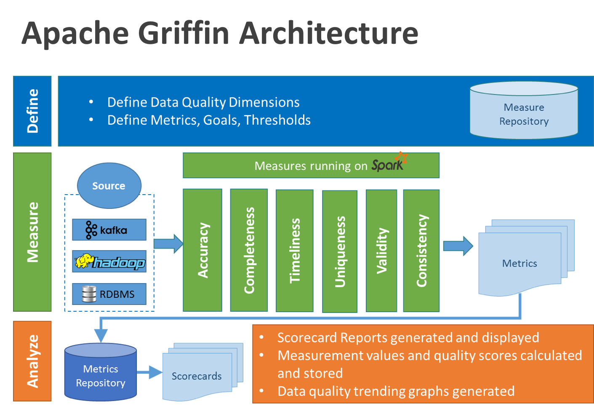
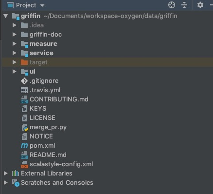

## Apache Griffin 入门指南

数据质量模块是大数据平台中必不可少的一个功能组件，[Apache Griffin](http://griffin.apache.org)（以下简称Griffin）是一个开源的大数据数据质量解决方案，它支持批处理和流模式两种数据质量检测方式，可以从不同维度（比如离线任务执行完毕后检查源端和目标端的数据数量是否一致、源表的数据空值数量等）度量数据资产，从而提升数据的准确度、可信度。

在Griffin的架构中，主要分为Define、Measure和Analyze三个部分，如下图所示：



各部分的职责如下：

* Define：主要负责定义数据质量统计的维度，比如数据质量统计的时间跨度、统计的目标（源端和目标端的数据数量是否一致，数据源里某一字段的非空的数量、不重复值的数量、最大值、最小值、top5的值数量等）
* Measure：主要负责执行统计任务，生成统计结果
* Analyze：主要负责保存与展示统计结果

基于以上功能，我们大数据平台计划引入Griffin作为数据质量解决方案，实现数据一致性检查、空值统计等功能。以下是安装步骤总结：

### 安装部署

#### 依赖准备

* JDK (1.8 or later versions)
* MySQL(version 5.6及以上)
* Hadoop (2.6.0 or later)
* Hive (version 2.x)
* Spark (version 2.2.1)
* Livy（livy-0.5.0-incubating）
* ElasticSearch (5.0 or later versions)

#### 初始化

初始化操作具体请参考[Apache Griffin Deployment Guide](https://github.com/apache/griffin/blob/master/griffin-doc/deploy/deploy-guide.md)，由于我的测试环境中Hadoop集群、Hive集群已搭好，故这里省略Hadoop、Hive安装步骤，只保留拷贝配置文件、配置Hadoop配置文件目录步骤。

1、MySQL：

在MySQL中创建数据库quartz，然后执行[Init_quartz_mysql_innodb.sql](https://github.com/apache/griffin/blob/master/service/src/main/resources/Init_quartz_mysql_innodb.sql)脚本初始化表信息：

```
mysql -u <username> -p <password> < Init_quartz_mysql_innodb.sql
```

2、Hadoop和Hive：

从Hadoop服务器拷贝配置文件到Livy服务器上，这里假设将配置文件放在/usr/data/conf目录下。

在Hadoop服务器上创建/home/spark_conf目录，并将Hive的配置文件hive-site.xml上传到该目录下：

```
#创建/home/spark_conf目录
hadoop fs -mkdir -p /home/spark_conf
#上传hive-site.xml
hadoop fs -put hive-site.xml /home/spark_conf/
```

3、设置环境变量：

```
#!/bin/bash
export JAVA_HOME=/data/jdk1.8.0_192

#spark目录
export SPARK_HOME=/usr/data/spark-2.1.1-bin-2.6.3
#livy命令目录
export LIVY_HOME=/usr/data/livy/bin
#hadoop配置文件目录
export HADOOP_CONF_DIR=/usr/data/conf
```

4、Livy配置：

更新livy/conf下的livy.conf配置文件：

```
livy.server.host = 127.0.0.1
livy.spark.master = yarn
livy.spark.deployMode = cluster
livy.repl.enable-hive-context = true
```

启动livy：

```
livy-server start
```

5、Elasticsearch配置：

在ES里创建griffin索引：

```
curl -XPUT http://es:9200/griffin -d '
{
    "aliases": {},
    "mappings": {
        "accuracy": {
            "properties": {
                "name": {
                    "fields": {
                        "keyword": {
                            "ignore_above": 256,
                            "type": "keyword"
                        }
                    },
                    "type": "text"
                },
                "tmst": {
                    "type": "date"
                }
            }
        }
    },
    "settings": {
        "index": {
            "number_of_replicas": "2",
            "number_of_shards": "5"
        }
    }
}
'
```

#### 源码打包部署

在这里我使用源码编译打包的方式来部署Griffin，Griffin的源码地址是：[https://github.com/apache/griffin.git](https://github.com/apache/griffin.git)，这里我使用的源码tag是griffin-0.4.0，下载完成在idea中导入并展开源码的结构图如下：



Griffin的源码结构很清晰，主要包括griffin-doc、measure、service和ui四个模块，其中griffin-doc负责存放Griffin的文档，measure负责与spark交互，执行统计任务，service使用spring boot作为服务实现，负责给ui模块提供交互所需的restful api，保存统计任务，展示统计结果。

源码导入构建完毕后，需要修改配置文件，具体修改的配置文件如下：

1、service/src/main/resources/application.properties：

```
# Apache Griffin应用名称
spring.application.name=griffin_service
# MySQL数据库配置信息
spring.datasource.url=jdbc:mysql://10.104.20.126:3306/griffin_quartz?useSSL=false
spring.datasource.username=xnuser
spring.datasource.password=Xn20!@n0oLk
spring.jpa.generate-ddl=true
spring.datasource.driver-class-name=com.mysql.jdbc.Driver
spring.jpa.show-sql=true
# Hive metastore配置信息
hive.metastore.uris=thrift://namenodetest01.bi:9083
hive.metastore.dbname=default
hive.hmshandler.retry.attempts=15
hive.hmshandler.retry.interval=2000ms
# Hive cache time
cache.evict.hive.fixedRate.in.milliseconds=900000
# Kafka schema registry，按需配置
kafka.schema.registry.url=http://namenodetest01.bi:8081
# Update job instance state at regular intervals
jobInstance.fixedDelay.in.milliseconds=60000
# Expired time of job instance which is 7 days that is 604800000 milliseconds.Time unit only supports milliseconds
jobInstance.expired.milliseconds=604800000
# schedule predicate job every 5 minutes and repeat 12 times at most
#interval time unit s:second m:minute h:hour d:day,only support these four units
predicate.job.interval=5m
predicate.job.repeat.count=12
# external properties directory location
external.config.location=
# external BATCH or STREAMING env
external.env.location=
# login strategy ("default" or "ldap")
login.strategy=default
# ldap，登录策略为ldap时配置
ldap.url=ldap://hostname:port
ldap.email=@example.com
ldap.searchBase=DC=org,DC=example
ldap.searchPattern=(sAMAccountName={0})
# hdfs default name
fs.defaultFS=
# elasticsearch配置
elasticsearch.host=griffindq02-test1-rgtj1-tj1
elasticsearch.port=9200
elasticsearch.scheme=http
# elasticsearch.user = user
# elasticsearch.password = password
# livy配置
livy.uri=http://10.104.110.116:8998/batches
# yarn url配置
yarn.uri=http://10.104.110.116:8088
# griffin event listener
internal.event.listeners=GriffinJobEventHook
```

2、service/src/main/resources/quartz.properties

```
#
# Licensed to the Apache Software Foundation (ASF) under one
# or more contributor license agreements.  See the NOTICE file
# distributed with this work for additional information
# regarding copyright ownership.  The ASF licenses this file
# to you under the Apache License, Version 2.0 (the
# "License"); you may not use this file except in compliance
# with the License.  You may obtain a copy of the License at
# 
#   http://www.apache.org/licenses/LICENSE-2.0
# 
# Unless required by applicable law or agreed to in writing,
# software distributed under the License is distributed on an
# "AS IS" BASIS, WITHOUT WARRANTIES OR CONDITIONS OF ANY
# KIND, either express or implied.  See the License for the
# specific language governing permissions and limitations
# under the License.
#
org.quartz.scheduler.instanceName=spring-boot-quartz
org.quartz.scheduler.instanceId=AUTO
org.quartz.threadPool.threadCount=5
org.quartz.jobStore.class=org.quartz.impl.jdbcjobstore.JobStoreTX
# If you use postgresql as your database,set this property value to org.quartz.impl.jdbcjobstore.PostgreSQLDelegate
# If you use mysql as your database,set this property value to org.quartz.impl.jdbcjobstore.StdJDBCDelegate
# If you use h2 as your database, it's ok to set this property value to StdJDBCDelegate, PostgreSQLDelegate or others
org.quartz.jobStore.driverDelegateClass=org.quartz.impl.jdbcjobstore.StdJDBCDelegate
org.quartz.jobStore.useProperties=true
org.quartz.jobStore.misfireThreshold=60000
org.quartz.jobStore.tablePrefix=QRTZ_
org.quartz.jobStore.isClustered=true
org.quartz.jobStore.clusterCheckinInterval=20000
```

3、service/src/main/resources/sparkProperties.json：

```
{
  "file": "hdfs:///griffin/griffin-measure.jar",
  "className": "org.apache.griffin.measure.Application",
  "name": "griffin",
  "queue": "default",
  "numExecutors": 2,
  "executorCores": 1,
  "driverMemory": "1g",
  "executorMemory": "1g",
  "conf": {
    "spark.yarn.dist.files": "hdfs:///home/spark_conf/hive-site.xml"
  },
  "files": [
  ]
}
```

4、service/src/main/resources/env/env_batch.json：

```
{
  "spark": {
    "log.level": "INFO"
  },
  "sinks": [
    {
      "type": "CONSOLE",
      "config": {
        "max.log.lines": 10
      }
    },
    {
      "type": "HDFS",
      "config": {
        "path": "hdfs://namenodetest01.bi.10101111.com:9001/griffin/persist",
        "max.persist.lines": 10000,
        "max.lines.per.file": 10000
      }
    },
    {
      "type": "ELASTICSEARCH",
      "config": {
        "method": "post",
        "api": "http://10.104.110.119:9200/griffin/accuracy",
        "connection.timeout": "1m",
        "retry": 10
      }
    }
  ],
  "griffin.checkpoint": []
}
```

配置文件修改好后，在idea里的terminal里执行如下maven命令进行编译打包：

```
mvn -Dmaven.test.skip=true clean install
```

命令执行完成后，会在service和measure模块的target目录下分别看到service-0.4.0.jar和measure-0.4.0.jar两个jar，将这两个jar分别拷贝到服务器目录下。这两个jar的使用方式如下：

1、使用如下命令将measure-0.4.0.jar这个jar上传到HDFS的/griffin文件目录里：

```
#改变jar名称
mv measure-0.4.0.jar griffin-measure.jar
#上传griffin-measure.jar到HDFS文件目录里
hadoop fs -put measure-0.4.0.jar /griffin/
```

这样做的目的主要是因为spark在yarn集群上执行任务时，需要到HDFS的/griffin目录下加载griffin-measure.jar，避免发生类org.apache.griffin.measure.Application找不到的错误。

2、运行service-0.4.0.jar，启动Griffin管理后台：

```
nohup java -jar service-0.4.0.jar>service.out 2>&1 &
```

几秒钟后，我们可以访问Apache Griffin的默认UI(默认情况下，spring boot的端口是8080)。

```
http://IP:8080
```

UI操作文档链接：[Apache Griffin User Guide](https://github.com/apache/griffin/blob/master/griffin-doc/ui/user-guide.md)。通过UI操作界面，我们可以创建自己的统计任务，部分结果展示界面如下：


#### 功能体验

1、在hive里创建表demo_src和demo_tgt：

```
--create hive tables here. hql script
--Note: replace hdfs location with your own path
CREATE EXTERNAL TABLE `demo_src`(
  `id` bigint,
  `age` int,
  `desc` string) 
PARTITIONED BY (
  `dt` string,
  `hour` string)
ROW FORMAT DELIMITED
  FIELDS TERMINATED BY '|'
LOCATION
  'hdfs:///griffin/data/batch/demo_src';

--Note: replace hdfs location with your own path
CREATE EXTERNAL TABLE `demo_tgt`(
  `id` bigint,
  `age` int,
  `desc` string) 
PARTITIONED BY (
  `dt` string,
  `hour` string)
ROW FORMAT DELIMITED
  FIELDS TERMINATED BY '|'
LOCATION
  'hdfs:///griffin/data/batch/demo_tgt';
```

2、生成测试数据：

从[http://griffin.apache.org/data/batch/](http://griffin.apache.org/data/batch/)地址下载所有文件到Hadoop服务器上，然后使用如下命令执行gen-hive-data.sh脚本：

```
nohup ./gen-hive-data.sh>gen.out 2>&1 &
```

注意观察gen.out日志文件，如果有错误，视情况进行调整。这里我的测试环境Hadoop和Hive安装在同一台服务器上，因此直接运行脚本。

3、通过UI界面创建统计任务，具体按照[Apache Griffin User Guide](https://github.com/apache/griffin/blob/master/griffin-doc/ui/user-guide.md)
一步步操作。

### 踩坑过程

1、gen-hive-data.sh脚本生成数据失败，报no such file or directory错误。

错误原因：HDFS中的/griffin/data/batch/demo_src/和/griffin/data/batch/demo_tgt/目录下"dt=时间"目录不存在，如dt=20190113。

解决办法：给脚本中增加hadoop fs -mkdir创建目录操作，修改完后如下：

```
#!/bin/bash

#create table
hive -f create-table.hql
echo "create table done"

#current hour
sudo ./gen_demo_data.sh
cur_date=`date +%Y%m%d%H`
dt=${cur_date:0:8}
hour=${cur_date:8:2}
partition_date="dt='$dt',hour='$hour'"
sed s/PARTITION_DATE/$partition_date/ ./insert-data.hql.template > insert-data.hql
hive -f insert-data.hql
src_done_path=/griffin/data/batch/demo_src/dt=${dt}/hour=${hour}/_DONE
tgt_done_path=/griffin/data/batch/demo_tgt/dt=${dt}/hour=${hour}/_DONE
hadoop fs -mkdir -p /griffin/data/batch/demo_src/dt=${dt}/hour=${hour}
hadoop fs -mkdir -p /griffin/data/batch/demo_tgt/dt=${dt}/hour=${hour}
hadoop fs -touchz ${src_done_path}
hadoop fs -touchz ${tgt_done_path}
echo "insert data [$partition_date] done"

#last hour
sudo ./gen_demo_data.sh
cur_date=`date -d '1 hour ago' +%Y%m%d%H`
dt=${cur_date:0:8}
hour=${cur_date:8:2}
partition_date="dt='$dt',hour='$hour'"
sed s/PARTITION_DATE/$partition_date/ ./insert-data.hql.template > insert-data.hql
hive -f insert-data.hql
src_done_path=/griffin/data/batch/demo_src/dt=${dt}/hour=${hour}/_DONE
tgt_done_path=/griffin/data/batch/demo_tgt/dt=${dt}/hour=${hour}/_DONE
hadoop fs -mkdir -p /griffin/data/batch/demo_src/dt=${dt}/hour=${hour}
hadoop fs -mkdir -p /griffin/data/batch/demo_tgt/dt=${dt}/hour=${hour}
hadoop fs -touchz ${src_done_path}
hadoop fs -touchz ${tgt_done_path}
echo "insert data [$partition_date] done"

#next hours
set +e
while true
do
  sudo ./gen_demo_data.sh
  cur_date=`date +%Y%m%d%H`
  next_date=`date -d "+1hour" '+%Y%m%d%H'`
  dt=${next_date:0:8}
  hour=${next_date:8:2}
  partition_date="dt='$dt',hour='$hour'"
  sed s/PARTITION_DATE/$partition_date/ ./insert-data.hql.template > insert-data.hql
  hive -f insert-data.hql
  src_done_path=/griffin/data/batch/demo_src/dt=${dt}/hour=${hour}/_DONE
  tgt_done_path=/griffin/data/batch/demo_tgt/dt=${dt}/hour=${hour}/_DONE
  hadoop fs -mkdir -p /griffin/data/batch/demo_src/dt=${dt}/hour=${hour}
  hadoop fs -mkdir -p /griffin/data/batch/demo_tgt/dt=${dt}/hour=${hour}
  hadoop fs -touchz ${src_done_path}
  hadoop fs -touchz ${tgt_done_path}
  echo "insert data [$partition_date] done"
  sleep 3600
done
set -e
```

2、HDFS的/griffin/persist目录下没有统计结果文件，检查该目录的权限，设置合适的权限即可。

3、ES中的metric数据为空，有两种可能：

* service/src/main/resources/env/env_batch.json里的ES配置信息不正确
* 执行spark任务的yarn服务器上没有配置ES服务器的hostname，连接异常

4、启动service-0.4.0.jar之后，访问不到UI界面，查看启动日志无异常。检查打包时是不是执行的mvn package命令，将该命令替换成mvn -Dmaven.test.skip=true clean install命令重新打包启动即可。

